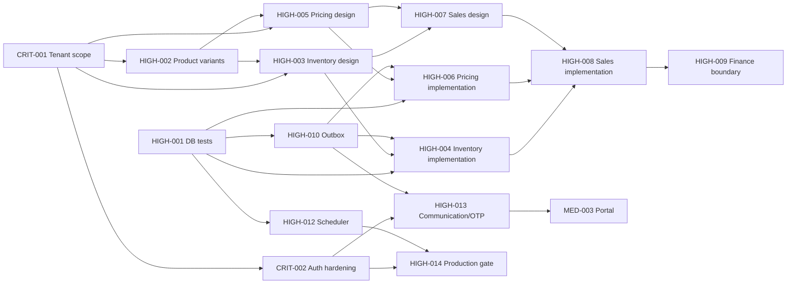

# Dependency map

## Critical path

The commercial-core path is CRIT-001 → HIGH-002 → HIGH-003/HIGH-005 →
HIGH-004/HIGH-006 → HIGH-007 → HIGH-008 → HIGH-009. HIGH-001 and HIGH-010 are
parallel foundation gates that must join before implementation.

## Parallel work

- HIGH-001 and LOW-001 can start immediately.
- After CRIT-001 decisions, product identity and file ownership can proceed.
- Inventory and Pricing design can proceed in parallel after HIGH-002.
- MED-005 is independent.

No circular dependency is intended; automated validation is LOW-001.
