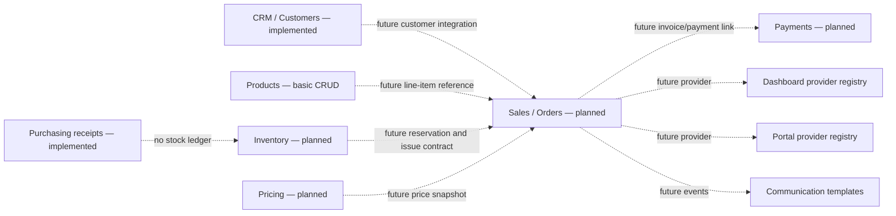

# Sales Module Discovery Report

**Audit date:** 2026-07-31  
**Branch:** `codex/final-sami-release`  
**Classification:** `ONLY_PLANNED`

## Executive Summary

SAMI ERP does not currently contain an executable Sales bounded context. There
is no Sales backend package, controller, service, entity, repository, DTO,
validation, workflow, event publisher/consumer, report provider, migration, or
test. There is also no Sales frontend route, page, API client, TypeScript
contract, schema, store, component, form, or test.

The repository contains several Sales-related declarations, but source evidence
explicitly identifies them as future-facing scaffolding:

- V4 seeds a disabled `orders` navigation module and mechanically generates its
  six generic permissions.
- V25 classifies `orders` as `PLANNED` on both backend and frontend axes, with
  zero progress and no production readiness.
- Dashboard, customer-portal, automation, CRM, scheduling, knowledge, and
  communication code/migrations contain extension points, labels, example
  payloads, or templates for a future Sales owner. None supplies Sales business
  behavior.
- Canonical documentation says Sales/order fulfillment, inventory, pricing,
  payment orchestration, and accounting have no confirmed owner and require
  architectural/business decisions before implementation.

Consequently, a complete Sales frontend cannot be implemented against the
current backend without inventing contracts and business rules.

## Audit Scope and Repository State

- Inspected the current backend Java source, Flyway migrations V1-V27, tests,
  security/RBAC seeds, dashboard/portal/automation/communication extension
  points, and canonical architecture documentation.
- Inspected frontend routes, menu loading, views, API clients, types, schemas,
  components, permissions, translations, mocks, and tests.
- Searched the full reachable Git object/history set and all available local and
  remote branches: `development`, `codex/final-sami-release`,
  `codex/sami-final-consolidation`, and `origin/development`.
- Existing unrelated worktree changes were preserved. This report is the only
  file created by this audit.

## Backend Status

### Status

**Does not exist — planned metadata only.**

The application packages under `com.sami.app` include authentication, RBAC,
automation, calendar, communication, CRM, dashboard, data quality, files,
knowledge, licensing, metadata, portal, products, purchasing, scheduling,
suppliers, and users. There is no `sales`, `order`, `invoice`, `checkout`,
`cart`, or sales-payment package.

### Controllers and APIs

No Sales controller or Sales API endpoint exists. Specifically, no endpoint was
found for:

- creating, reading, updating, or deleting a sale/order;
- pricing or checkout;
- approval, cancellation, completion, fulfillment, delivery, or return;
- invoice generation or invoice-item management;
- payment intent, capture, settlement, refund, or reconciliation;
- stock reservation, inventory issue, or inventory reduction;
- Sales reporting or receipt generation.

Keyword matches in existing controllers belong to other bounded contexts:

- `PurchaseController` exposes purchasing receipt reads.
- `LicensingController` changes a software-license payment status.
- `SupplierConfigController` manages supplier payment terms.

These are not Sales APIs and cannot support a Sales workflow.

### Services, Entities, Repositories, and DTOs

No Sales-owned service, entity, repository, DTO, mapper, validator, enum, or
exception was found. There are no `Sale`, `SalesOrder`, `CustomerOrder`,
`Invoice`, `InvoiceItem`, `Cart`, `Checkout`, `Payment`, or sales `Receipt`
application types.

Similarly named existing types have different owners:

- `PurchaseReceipt` and `PurchaseReceiptItem` record inbound supplier receipt
  quantities within purchasing; documentation explicitly says they are not an
  inventory ledger.
- `PaymentStatus` belongs to enterprise software licensing.
- `SupPaymentTerm` belongs to supplier configuration.
- `SendReceipt` is a communication-delivery result, not a commercial receipt.

### Database and Migrations

No authoritative Sales table exists. Searches found no Sales/order/invoice/cart
or commercial-payment table, foreign key, constraint, index, or seed model.

Relevant non-implementation metadata is:

- `V4__rbac_seed.sql` seeds an `orders` module at `/orders` with
  `enabled = FALSE`. Its generic `orders:view/create/edit/delete/export/import`
  permissions are generated by the common module-permission seed and are not
  enforced by any Sales controller.
- `V25__module_lifecycle.sql` explicitly identifies `orders` as a navigation
  scaffold with “no Java package, no tables, and disabled,” then assigns
  `PLANNED` to both axes, zero progress, and non-production-ready status.
- `V10__dashboard.sql` seeds an inactive `sales` dashboard data source, but no
  `ReportingProvider` with key `sales` exists.
- `V21__customer_portal.sql` seeds `sales.purchases` and `sales.invoices` widget
  provider keys. `PortalDashboardService` marks widgets unavailable when their
  provider is absent; no matching Sales provider exists.
- `V27__communication_hub.sql` provides invoice-delivery and delivery-notice
  message templates. Templates do not create invoices, orders, deliveries, or
  Sales events.

### Permissions and Security

There are no `sales:*` permissions. The only plausible permissions are the
generic `orders:*` seed permissions listed above. They have no backend
enforcement points because no Sales controller exists.

No Sales tenant/company/branch/store scoping policy exists. There is therefore
no verified Sales authorization boundary, trusted-scope repository query, or
cross-tenant Sales protection to reuse today.

### Workflows, Events, Reports, and Audit

- No Sales lifecycle or transition service exists.
- No Sales domain event exists and no Sales event is published or consumed.
- No Sales audit model or audit-read API exists.
- No Sales report implementation exists.
- `ReportingProvider` documents how a future Sales module could integrate with
  dashboards, but the example is not executable code.
- CRM provides a future integration seam for other modules to append purchase
  or payment timeline events; no Sales module calls it.
- Automation documentation mentions future actions such as invoice generation;
  no corresponding action provider is registered.

### Backend Capability Matrix

| Requested capability | Current support | Evidence-based conclusion |
|---|---|---|
| Create/update sale or order | No | No owner, API, DTO, service, entity, or table |
| Cancel/approve/complete sale | No | No lifecycle or transition implementation |
| Checkout/cart | No | No types, services, endpoints, or persistence |
| Pricing/tax/discount calculation | No | Canonical documentation marks pricing policy unresolved |
| Payment handling/refunds | No | Only licensing payment state and supplier terms exist |
| Invoice generation | No | Communication template and automation comment only |
| Inventory reservation/reduction | No | No inventory ledger or reservation contract |
| Customer relation | Foundation only | CRM customer APIs/events exist, but no Sales consumer |
| Fulfillment/delivery/returns | No | Message/appointment labels are not workflows |
| Sales receipt | No | Purchasing and communication use unrelated “receipt” concepts |
| Sales reporting | No | Inactive data-source metadata; no provider |
| Audit/history | No | No Sales audit owner or executable history |

## Frontend Status

### Existing Pages and Routes

No `/sales` or `/orders` static route exists. No `SalesView`, `OrdersView`,
Sales detail screen, checkout screen, invoice screen, or payment screen exists.

The frontend has a generic `PlaceholderView`, used for dynamically registered
modules whose lifecycle metadata says their UI is not ready. If an administrator
enabled the seeded `/orders` module, this generic lifecycle placeholder—not a
Sales implementation—would be the only possible presentation.

### Existing Menu and Permissions

- The menu is backend-driven and includes only enabled modules the user may
  view. The seeded `orders` module is disabled.
- `server.module.orders` translations exist in English and Persian solely to
  label module metadata.
- There are no Sales action translations, form translations, route guards,
  permission constants, or UI action checks.

### API Clients, Types, Forms, and Components

No Sales API client, TypeScript type, schema, composable, Pinia store, form,
dialog, table/card view, invoice renderer, payment component, or Sales-specific
reusable component exists. Existing product, customer, purchasing, dashboard,
and shared UI artifacts could inform a future design but do not collectively
form a Sales frontend.

### Unfinished Work and Other Branches

No partial Sales implementation was found in the current worktree or any
reachable branch. Git history contains no reachable Sales-named source paths and
no Sales implementation commit. The only matching history concerns module
lifecycle metadata, which deliberately classifies `orders` as planned.

No Sales screenshots or implemented UI plans were found in repository
documentation.

## Business Capability

SAMI cannot execute a Sales transaction today. It can manage reusable adjacent
master data such as customers and products, record supplier purchases, and host
generic dashboard/CRM/communication extension points. It cannot turn those
capabilities into an order, calculate an authoritative price, reserve or issue
stock, accept or reconcile payment, generate an invoice, fulfill or return an
order, or report Sales results.

The Sales-related portal widgets and communication templates will remain
unavailable or unused until a real Sales owner implements and registers the
required providers/events.

## Current Architecture Map

Solid implementation paths end before Sales. Dotted edges are explicitly
future-facing or inferred integration needs; they are not current executable
dependencies.

## Implementation Readiness

### `ONLY_PLANNED`

This is not `READY_FOR_FRONTEND_IMPLEMENTATION`: there are no public Sales APIs
or DTO contracts for a frontend to consume.

It is also more accurately `ONLY_PLANNED` than `BACKEND_INCOMPLETE`: the
repository has metadata and architectural extension points, but no meaningful
Sales backend slice has started.

## Highest-Fan-In Blockers

1. **Inventory ownership and reservation contract.** Sales fulfillment,
   availability, cancellation, returns, serialized-device assignment, and stock
   correctness all depend on a canonical inventory ledger that does not exist.
2. **Sales/order aggregate and lifecycle.** APIs, permissions, audit, events,
   invoices, UI actions, and reporting all depend on an agreed owner and state
   machine.
3. **Pricing snapshot policy.** Checkout totals, tax/rounding, discounts,
   promotions, historical explanation, and refunds depend on immutable pricing
   semantics.
4. **Payment contract.** Completion, refunds, reconciliation, customer balances,
   and accounting links depend on payment intent/attempt/refund ownership and
   idempotency.
5. **Trusted organization scope.** Customer, tenant, company, branch/store,
   salesperson, inventory location, and cross-scope administration must be
   authoritative and consistently enforced.

These blockers have the highest fan-in because each is required by several of
the requested Sales operations and downstream integrations.

## Missing Requirements

Before a complete Sales workflow can be designed or implemented, the project
needs approved contracts for:

### Domain and persistence

- Sales bounded-context owner and terminology (`sale`, `order`, invoice, or a
  separated order/invoice model).
- Order header/item model, identifiers, immutable commercial snapshots, and
  customer/product references.
- Tenant/company/branch/store/salesperson scope and cross-scope rules.
- Configurable order lifecycle, allowed transitions, terminal states, and
  transition actors.
- Draft editing, approval thresholds, cancellation, fulfillment, delivery,
  return/exchange, partial fulfillment, and partial return behavior.
- Optimistic concurrency and idempotency keys for creation and transitions.
- Currency, tax, rounding, price lists, discounts, promotions, and historical
  price explanation.
- Invoice ownership, numbering, legal fields, issuance/reversal rules, and
  printable/exportable document policy.

### Inventory and serialized products

- Canonical warehouse/store/location and immutable stock-ledger owner.
- Reservation, release, allocation, issue, cancellation, and return contracts.
- IMEI/serial selection, uniqueness, state transitions, and concurrency.
- Overselling policy, availability checks, stock-count interaction, and failure
  recovery.

### Payments and accounting

- Payment intent, attempt, authorization/capture, settlement, failure, refund,
  and reconciliation lifecycle.
- Cash/card/installment/mixed-payment policy and provider ownership.
- PCI boundary, webhook authentication, replay protection, and idempotency.
- Sales completion versus payment status rules.
- Accounting posting ownership, tax treatment, receivables, reversals, and
  immutable source links.

### APIs, security, audit, and events

- Request/response DTOs, validation, error codes, pagination/filtering/sorting,
  and public API versioning.
- Fine-grained Sales permissions and server-side transition authorization.
- Trusted tenant/company/branch/store scope on every query and uniqueness rule.
- Audit content, before/after attribution, sensitive-data handling, retention,
  and audit-read permissions.
- Domain events, transaction timing, durability, ordering, retries, and
  idempotent consumers.
- CRM timeline, dashboard, portal, communication, automation, files, reports,
  and notification-center integration contracts.

### Frontend contract

- Approved information architecture and workflows after backend contracts
  exist: list, create/edit, detail, checkout, payment, invoice, fulfillment,
  return, reporting, and mobile behavior.
- Permission/action matrix, loading/error/empty states, localization vocabulary,
  RTL invoice behavior, accessibility, and responsive requirements.
- Download/print formats and Persian/English invoice requirements.

### Verification

- Backend unit/integration tests for scope isolation, lifecycle, pricing,
  inventory concurrency, payment idempotency, invoice numbering, audit, events,
  and returns.
- Migration fresh/upgrade validation and schema/entity reconciliation.
- API-contract tests and frontend type alignment.
- English/Persian, RTL/LTR, responsive, permission, error-state, and end-to-end
  workflow tests.

## Evidence Index

- `docs/00-project-overview.md`: explicitly lists Sales/order fulfillment,
  pricing, payment orchestration, inventory, and accounting as non-capabilities.
- `docs/04-domain-model.md`: says Sales/orders and dependencies require explicit
  bounded contexts and integration contracts.
- `docs/05-module-catalog.md`: classifies Inventory/Sales/Pricing/Payments/
  Accounting as Planned with no owner or authoritative migration.
- `docs/24-roadmap-and-open-decisions.md`: records unresolved decisions required
  before Inventory, Sales, Pricing, Payments, and Accounting.
- `sami-backend/src/main/resources/db/migration/V4__rbac_seed.sql`: disabled
  `/orders` module and generic permission scaffolding.
- `sami-backend/src/main/resources/db/migration/V25__module_lifecycle.sql`: exact
  source statement that `orders` has no Java package or tables and is planned at
  zero progress.
- `sami-backend/src/main/resources/db/migration/V10__dashboard.sql`: inactive
  `sales` reporting-provider key.
- `sami-backend/src/main/java/com/sami/app/dashboard/spi/ReportingProvider.java`:
  future Sales integration example, not an implementation.
- `sami-backend/src/main/resources/db/migration/V21__customer_portal.sql` and
  `PortalDashboardService`: future provider keys are unavailable without a
  registered owner.
- `sami-backend/src/main/resources/db/migration/V27__communication_hub.sql`:
  Sales-oriented templates without Sales execution paths.
- `sami-frontend/src/router/index.ts`, `src/api`, `src/types`, `src/schemas`, and
  `src/views`: no Sales frontend contract or screen.
- Git branch, object, content, and history searches: no alternate reachable
  branch contains Sales implementation work.

## Confidence and Unverified Areas

**Confidence: high.** The classification is supported independently by current
source absence, explicit V25 lifecycle data, canonical documentation, frontend
inventory, and all reachable Git branches/history.

No application runtime or database query was required: repository migrations
and executable source are sufficient to establish that no Sales implementation
exists. Unreachable commits, external repositories, unpushed developer branches,
or private design artifacts cannot be assessed from this workspace.

