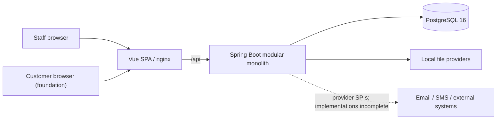
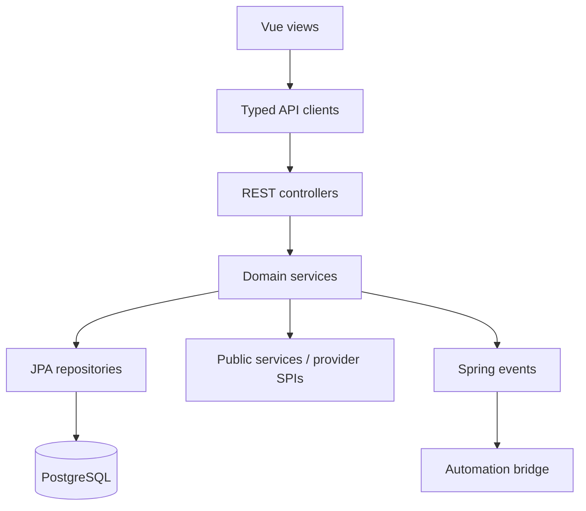

# System architecture

## Context and containers

The SPA performs presentation-level route checks. Spring Security and
`@PreAuthorize` are the authorization boundary. Controllers delegate to
transactional domain services; repositories own persistence access. Flyway
creates schema and Hibernate validates it.

## Dependency direction

Cross-domain code should prefer public services, event contracts, or explicit
SPIs over another module's repository.

## Request lifecycle

1. nginx/Vite forwards `/api`.
2. JWT filter authenticates staff requests.
3. Spring Security and method authorization enforce access.
4. Controller validates DTOs and invokes a service.
5. Service opens the required transaction and applies invariants.
6. Repository persists; domain events may be published.
7. `ApiResponse<T>` or centralized error handling shapes the response.

General Spring events are process-local. `AFTER_COMMIT` prevents consumers from
seeing rolled-back writes but does not provide crash-safe delivery.

## Deployment

Production Compose connects PostgreSQL, a non-root Java 21 backend container,
and nginx serving the built SPA. PostgreSQL is not host-published. nginx proxies
to the backend service at port `8080`.
