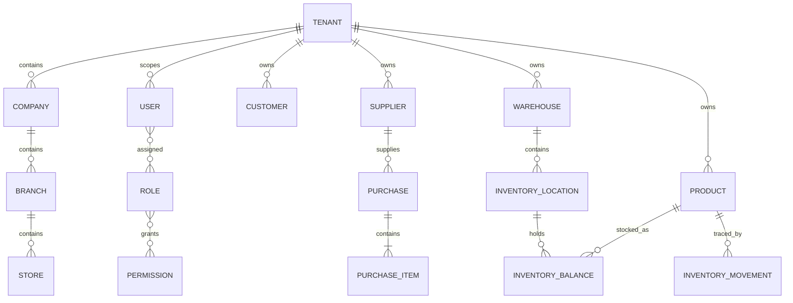

# Domain model

## Confirmed business concepts

| Concept | Current owner | Notes |
|---|---|---|
| Tenant | `licensing`, `common.tenancy` | Trusted isolation root resolved from the authenticated server-side principal |
| Company / Branch / Store | organization migrations and shared mappings | Organizational hierarchy; lifecycle corrections exist in V26 |
| Staff User / Role / Permission | `user`, `authz`, `security` | Database-driven RBAC; super-admin bypass |
| Counterparty | Approved business model | One Natural Person or Legal Entity/Company/Store identity with one unified business-facing financial account; current source still stores Customer/Supplier separately |
| Customer / Supplier roles | `crm` / `supplier` current source | Commercial roles may coexist on the same approved Counterparty; they must not create contradictory separate balances |
| Product | `product` | Catalog owner; legacy integer stock is an Inventory compatibility projection |
| Purchase | `purchasing` | Items, approvals, receiving, IMEI/serial capture, returns, logs; receipt/return stock posts to Inventory |
| Inventory | `inventory` | Warehouses, locations, balances, append-only movements, serials, reservations, transfers, counts, valuation and audit |
| Sale | `sales` | Orders, lifecycle, payments, returns and Inventory reservation/issue integration |
| Dashboard / KPI / Widget | `dashboard` | Configurable dashboard and calculation infrastructure |
| Managed file | `files` | Versioning, metadata, scans, derivatives, retention and quota |
| Scheduled job | `common.scheduler` | Handler registry, polling, locking, executions and timeout |

## Current implementation relationships

The following diagram records the current source relationships. It is not a
claim that the approved unified Counterparty financial-account model has already
been implemented.

## Active behavioral notes

- Quotation and proforma are non-posting commercial documents.
- Registered order price is preserved, and confirmed orders may only be
  corrected by their creator during the configurable correction window.
- When stock is short, the available quantity is reserved and the remainder is
  backordered.
- Received customer cheques settle debt on receipt and keep reducing available
  credit until clearance.
- Closed financial periods require manager authorization for modification and
  are not treated as absolute immutability.
- Contact is the shared identity for a real person or organization. Customer and
  Supplier are commercial roles on that identity; controlled merges preserve
  all commercial and financial history.
- A Sales Invoice creates the customer receivable and an accepted Supplier
  Invoice creates the supplier payable. Delivery and Goods Receipt remain the
  independent physical-stock facts.
- The operating monetary unit is Toman. Multi-currency is deferred scope.

## Invariants visible in architecture

- Backend permissions—not frontend visibility—protect operations.
- Flyway is the schema owner; entity mappings must validate against it.
- New tenant-scoped operations resolve the trusted tenant through `TenantContext`
  and fail closed when no authenticated tenant is available.
- Lifecycle transitions are service operations, not arbitrary status updates.
- Purchasing owns receipt evidence; Inventory owns the resulting canonical balance,
  movement, serial and valuation state.
- Auditable entities inherit common ID/timestamp conventions where applicable.

## Undefined future ownership

Sales owns approved price-list/price-resolution policy; current source does not
yet implement the approved model. Accounting still requires explicit bounded
context and integration contracts before it can own canonical journals and
financial statements.
