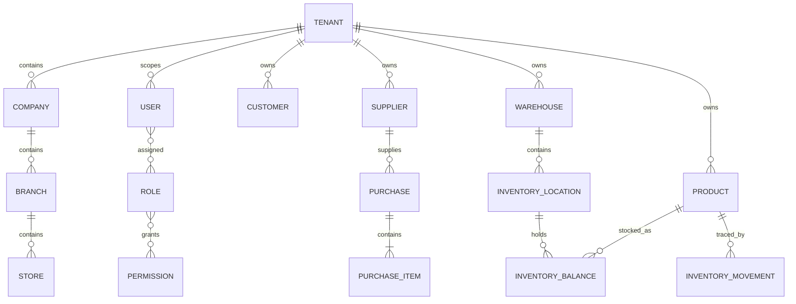

# Domain model

## Confirmed business concepts

| Concept | Current owner | Notes |
|---|---|---|
| Tenant | `licensing`, `common.tenancy` | Trusted isolation root resolved from the authenticated server-side principal |
| Company / Branch / Store | organization migrations and shared mappings | Organizational hierarchy; lifecycle corrections exist in V26 |
| Staff User / Role / Permission | `user`, `authz`, `security` | Database-driven RBAC; super-admin bypass |
| Customer | `crm` | Lifecycle, notes, relations, segments, imports and duplicate handling |
| Supplier | `supplier` | Lifecycle, categories, ratings, documents and payment terms |
| Product | `product` | Catalog owner; legacy integer stock is an Inventory compatibility projection |
| Purchase | `purchasing` | Items, approvals, receiving, IMEI/serial capture, returns, logs; receipt/return stock posts to Inventory |
| Inventory | `inventory` | Warehouses, locations, balances, append-only movements, serials, reservations, transfers, counts, valuation and audit |
| Sale | `sales` | Orders, lifecycle, payments, returns and Inventory reservation/issue integration |
| Dashboard / KPI / Widget | `dashboard` | Configurable dashboard and calculation infrastructure |
| Managed file | `files` | Versioning, metadata, scans, derivatives, retention and quota |
| Scheduled job | `common.scheduler` | Handler registry, polling, locking, executions and timeout |

## Invariants visible in architecture

- Backend permissions—not frontend visibility—protect operations.
- Flyway is the schema owner; entity mappings must validate against it.
- New tenant-scoped operations resolve the trusted tenant through `TenantContext`
  and fail closed when no authenticated tenant is available.
- Lifecycle transitions are service operations, not arbitrary status updates.
- Purchasing owns receipt evidence; Inventory owns the resulting canonical balance,
  movement, serial and valuation state.
- Auditable entities inherit common ID/timestamp conventions where applicable.

## Undefined future ownership

Pricing and accounting require
explicit bounded contexts and integration contracts. Their proposed models
must not be inserted into documentation as current implementation.
