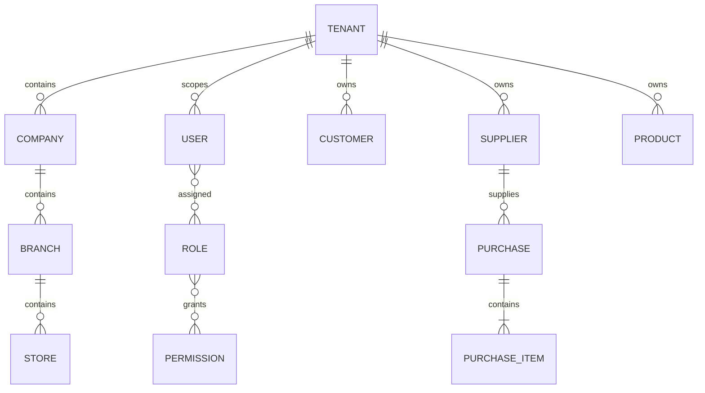

# Domain model

## Confirmed business concepts

| Concept | Current owner | Notes |
|---|---|---|
| Tenant | `licensing`, tenancy migrations | Isolation root, but runtime resolution is transitional |
| Company / Branch / Store | organization migrations and shared mappings | Organizational hierarchy; lifecycle corrections exist in V26 |
| Staff User / Role / Permission | `user`, `authz`, `security` | Database-driven RBAC; super-admin bypass |
| Customer | `crm` | Lifecycle, notes, relations, segments, imports and duplicate handling |
| Supplier | `supplier` | Lifecycle, categories, ratings, documents and payment terms |
| Product | `product` | Current CRUD is simpler than a future variant/SKU inventory model |
| Purchase | `purchasing` | Items, approvals, receiving, IMEI/serial capture, returns, logs |
| Dashboard / KPI / Widget | `dashboard` | Configurable dashboard and calculation infrastructure |
| Managed file | `files` | Versioning, metadata, scans, derivatives, retention and quota |
| Scheduled job | `common.scheduler` | Handler registry, polling, locking, executions and timeout |

## Invariants visible in architecture

- Backend permissions—not frontend visibility—protect operations.
- Flyway is the schema owner; entity mappings must validate against it.
- Tenant-bearing writes currently receive a default tenant through a bridge.
- Lifecycle transitions are service operations, not arbitrary status updates.
- Purchase receipt quantities and serial/IMEI rows belong to purchasing today;
  they must not be described as authoritative stock.
- Auditable entities inherit common ID/timestamp conventions where applicable.

## Undefined future ownership

Inventory/warehouse, sales/orders, pricing, payments, and accounting require
explicit bounded contexts and integration contracts. Their proposed models
must not be inserted into documentation as current implementation.
