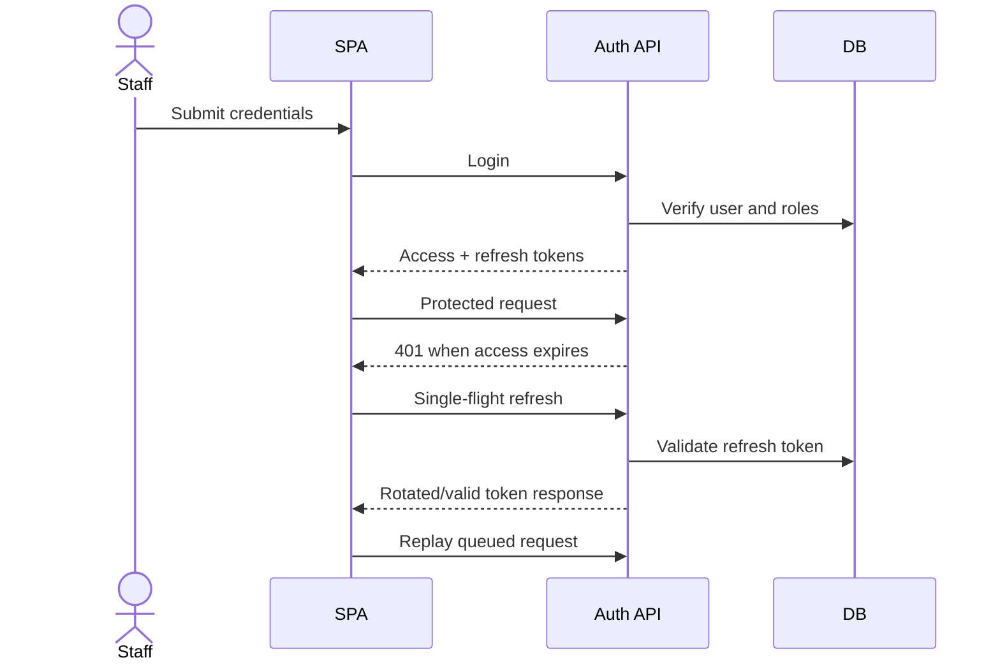

# Confirmed workflow details

## Login and token refresh

Failure paths include invalid credentials, disabled user, invalid/expired
refresh token and insufficient permissions. Tokens are currently stored in
`localStorage`.

## Purchase lifecycle

The purchase controller delegates creation/update and lifecycle work to
`PurchaseService`; approval, receipt and return behavior is separated into
specialized services. Receipt records received quantities and serial/IMEI data.
Permissions under the purchasing namespace guard operations; logs/events record
changes. Inventory balances, reservation and valuation are not affected because
no inventory ledger exists.

## Scheduled job execution

The poller claims eligible persisted jobs, resolves a `JobHandler`, records an
execution, runs with a configured timeout, then records success/failure and
updates scheduling state. Missing handler, lock contention, exception and
timeout are failure paths. A timeout record does not guarantee the handler has
stopped.

## Managed-file lifecycle

Upload validates metadata/content and stores managed metadata plus provider
content. Later operations support versions, retrieval, rollback, tags/folders,
soft deletion/restoration and retention. Authorization and tenant ownership
must be checked on every read/write. Provider/storage failure can leave cleanup
work; inspect service transaction boundaries before changing the flow.

Other workflow summaries are indexed in
[business workflows](../06-business-workflows.md).
